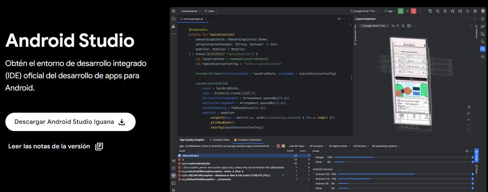
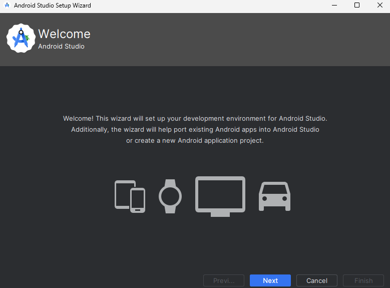
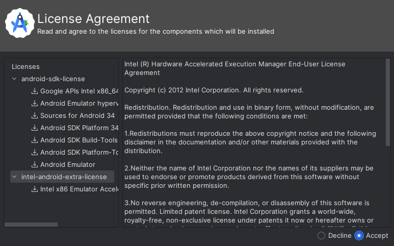
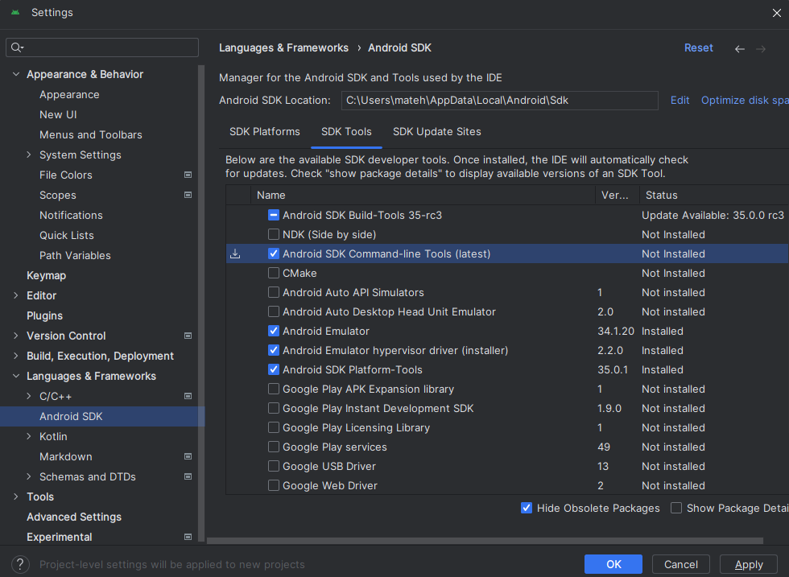
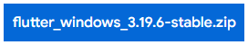
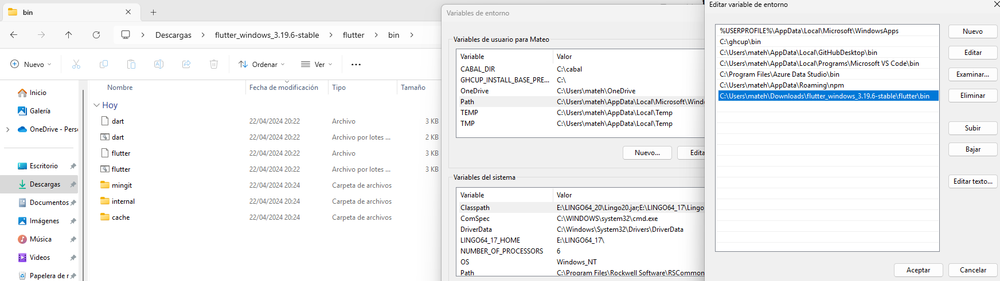
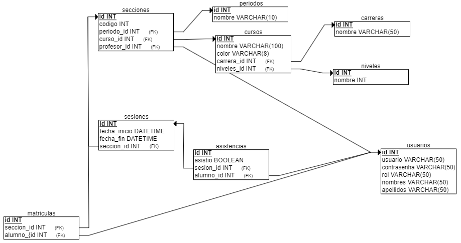
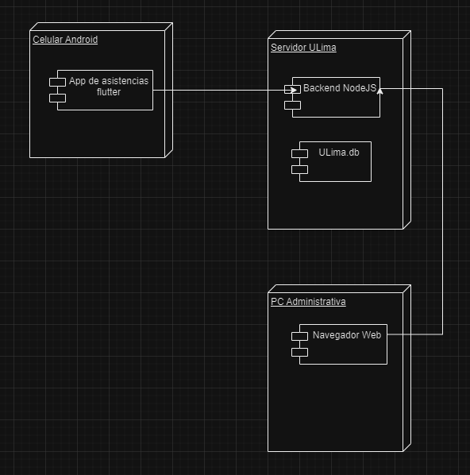
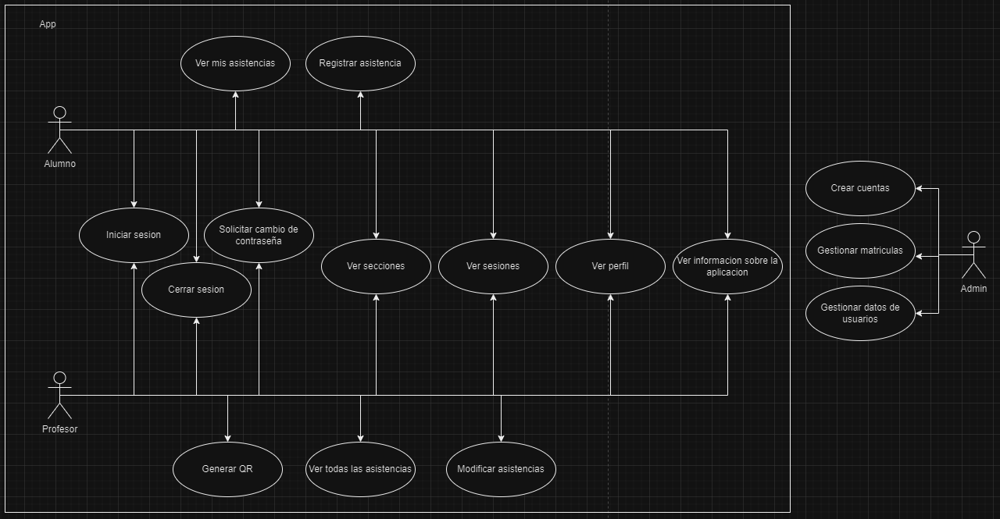
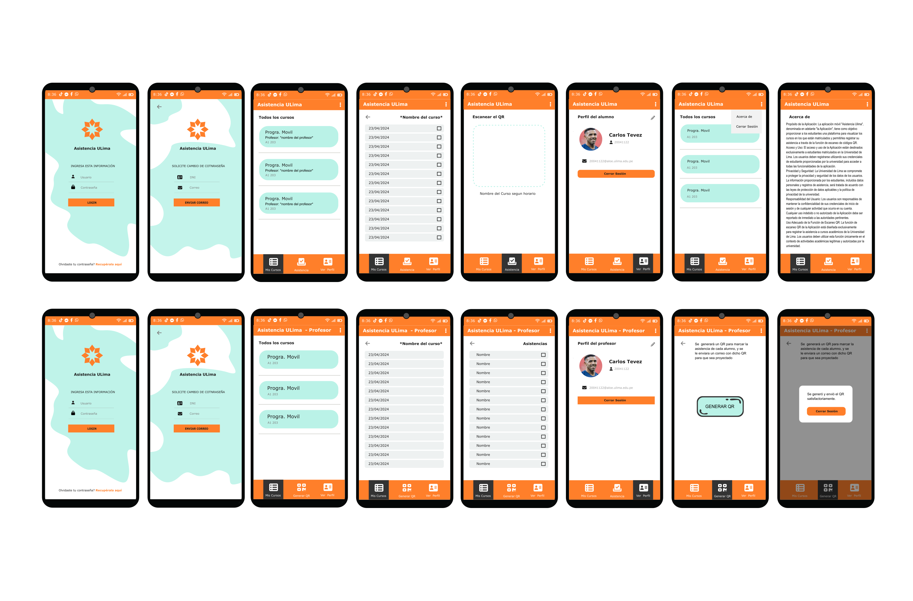

# Asistencia ULima

- [Entorno de desarrollo](#breve-explicación-del-entorno-de-desarrollo)
- [Diagrama de despliegue](#diagrama-de-despliegue)
- [Requerimientos no funcionales](#requerimientos-no-funcionales)
- [Requerimientos funcionales](#requerimientos-funcionales)
- [Mockup](#mockups)

## Breve explicación del entorno de desarrollo
- Draw.io: Es una herramienta de diagramación, de diagrama de flujo, de proceso, entre otras muchas funciones. Es una herramienta gratuita con la que se puede dibujar cualquier tipo de mapas mentales, mapas conceptuales, esquemas o diferentes representaciones gráficas, como diagrama de jerarquía o conjuntos. Instalacion: No hay proceso de instaacion por tseruna plataforma web
- ERDPlus: Es una herramienta de modelado de bases de datos basada en web que le permite crear rápida y fácilmente diagramas de entidad-relación, esquemas relacionales y esquemas en estrella. Más características: covertir automáticamente diagramas ER en esquemas relacionales, exportar SQL y exportar diagramas como PNG. Instalacion: No hay proceso de instalacion por ser una plataforma web

- Inkscape: Es un editor de gráficos vectoriales que permite: diseñar imágenes de calidad, básicas o complejas; cear y editar diagramas, líneas, gráficos, logotipos, cómics, folletos, entre otros; utilizar formas, trazos, texto, marcadores, clones, y otras herramientas de diseño. 
Instalación: Ingresar a la pagina oficial de [Inkscape](https://inkscape.org/release/inkscape-1.3.2/) y descargar la úlitma version. Luego abrir el instalador, otorgar los permisos, seleccionar la ruta y darle a continuar e instalar. Se podrá abrir la aplicación Inkscape luego de una ventana de configuración rápida.

- Node: Es un entorno de ejecución JavaScript de código abierto y multiplataforma que se utiliza para desarrollar aplicaciones escalables del lado del servidor y de red. Está basado en el motor de ejecución JavaScript V8 de Google Chrome. Instalación: Ingresar a la pagina oficial de [Node](https://nodejs.org/en/download) y descargar la úlitma version. Abrir el instalador, aceptar las licencias, colocar la ruta de instacion, continuar e instalar. Verificar la instacion con el comando `node -v`

- SQLite Browser: Es una herramienta visual de código abierto de alta calidad para crear, diseñar y editar archivos de bases de datos compatibles con SQLite. Destinado a usuarios y desarrolladores que desean crear, buscar y editar bases de datos. Utiliza una interfaz familiar similar a una hoja de cálculo y no es necesario aprender comandos SQL complicados. Instalación: Ingresar a la pagina oficial de [SQLite Browser](https://sqlitebrowser.org/dl/) y descargar la version portable. Descomprimir el archivo y abrir el ejecutable.

- Vysor: Vysor es una aplicación que permite compartir y controlar remotamente la pantalla de un dispositivo iOS o Android desde otro dispositivo. Es compatible con todos los sistemas operativos, incluidos Windows, Apple y Linux. Instalación: Ingresar a la pagina oficial de [Vysor](https://www.vysor.io/). Abrir el ejecutable y aceptar los permisos. Finalmente se podrán configurar los dispositivos deseados.

RECOMENDACIÓN: INSTALAR ANDROID STUDIO ANTES DE FLUTTER

- Android Studio: Android Studio es el entorno de desarrollo integrado (IDE) oficial que se usa en el desarrollo de apps para Android. Basado en el potente editor de código y las herramientas para desarrolladores de [IntelliJ IDEA](https://www.jetbrains.com/idea/), Android Studio ofrece aún más funciones que mejoran tu productividad cuando compilas apps para Android.

    1. Ingresar a [Android Studio](https://developer.android.com/studio?hl=es-419) y descargar Android Studio Iguana.
    

    2. Seguir los pasos: Next -> Next -> Install -> Next -> Finish

    3. Al ingresar al programa, seguimos los siguientes pasos finales para acabar con la instalación: Next -> Next -> Next
    
    
    4. Debemos de aceptar todas las licencias y darle a Finish.
    

    5. Una vez ingresado al programa dirigirse a customize -> all settings -> Languages & Frameworks -> Android SDK -> SDK Tools y activar la pestaña de Android SDK Command-line Tools (lastest). Seguidamente darle a "Apply" y "OK".
    
    

- Flutter: Flutter utiliza el lenguaje de programación Dart y se compila en código máquina. Los dispositivos host entienden este código, lo que garantiza un rendimiento rápido y eficaz. Rendimiento rápido, consistente y personalizable.

1. Abrir la página oficial de [Flutter](https://docs.flutter.dev/get-started/install/windows/mobile?tab=download) y descargar la última versión.

2. Descomprimir el archivo .zip, entrar a la carpeta bin y copiar la ruta. Entrar dentro de nuestro variable de entorno de la cuenta, finalmente pegar la ruta.

3. Abrir el cmd e ingresar: flutter doctor --android-licenses

4. Aceptar todo lo que nos exige la licencia ingresando la opción de "y" para cada uno.

- VSCode: Visual Studio Code (VS Code) es un editor de código fuente ligero y eficaz desarrollado por Microsoft para Windows, Linux, macOS y Web. Es un editor de texto enriquecido como Sublime Text y Atom, y está considerado el editor de texto más utilizado por los desarrolladores. Para acceder al lugar de descarga ingresar a [VSCode](https://code.visualstudio.com/download). Ingresamos al instalador, aceptamos el acuerdo de los términos y condiciones. Es recomendable dejar la carpeta donde se almacenará todo el programa en el disco C, le damos a siguiente -> siguiente -> Instalar -> Finalizar.

- Replit: Es una herramienta que permite a los usuarios escribir código y crear aplicaciones y sitios web mediante un navegador. El sitio también tiene varias funciones de colaboración, incluida la capacidad de edición multiusuario en tiempo real con una fuente de chat en vivo. Instalacion: No hay proceso de instalacion por ser una plataforma web

## Modelo relacional

## Diagrama de despliegue

El presente diagrama tiene como finalidad poder ver la arquitectura física de nuestra aplicación. Donde lo haremos en un entorno Android, conectado a un backend en NodeJS, asi mismo, tendremos una base de datos llamada ULima conectado al mismo servidor ULima. Finalmente en una PC administrativa se tendrá un navegador Web.

## Requerimientos no funcionales

- Que la app movil esté desarrollada con Flutter
- Que el backend esté desarrollado en Nodejs
- Que la base de datos utilice SQLite
- Que use los colores ulima
- Que el idioma sea español
- Que la interfaz sea intuitiva y facil de usar
- Que tenga un tiempo de respuesta rápido en el escaneo de QRs
- Que la app sea ligera. <50MB
- Que la app este disponible 99% de la semana.
- Que el mantenimiento se realicen los dias domingos.
- Que los datos se manejen de forma segura.

## Requerimientos funcionales

- El alumno puede registrar su asistencia
- El alumno puede ver todas sus asistencias a lo largo del tiempo
- Ambos usuarios pueden iniciar sesion, cerrar sesion y solicitar un cambio de contraseña.
- Ambos usuarios pueden ver las secciones a las que estan asignadas y las sesiones que tiene dicha clase.
- Ambos usuarios pueden ver su perfil
- Ambos usuarios pueden ver informacion sobre la aplicacion en el apartado de "Acerca de".
- El profesor puede generar el QR para la asistencia
- El profesor puede ver todas las asistencias de todos sus alumnos
- El profesor puede modificar la asistencia de algun alumno

## Mockup

